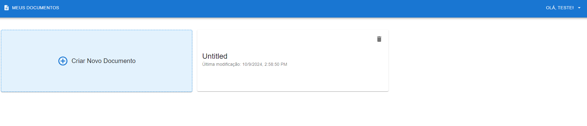

Pendênte:

- Teste automatizado de integração
- Deploy com Vercel

Principais dificultades:

- Testes com front devido ao tempo pela quantidade de coisas
- Mostrar a edição em tempo real no editor

---

# 📝 Projeto: Editor Colaborativo de Documentos em Tempo Real

Este projeto é um editor colaborativo de documentos, similar ao Google Docs, com a funcionalidade de versionamento de documentos e edição em tempo real. O projeto inclui um front-end em **React** e um back-end que serve a API e gerencia a comunicação em tempo real com **Socket.IO**.




## 📑 Funcionalidades

- Criação, listagem e exclusão de documentos.
- Edição colaborativa de documentos em tempo real.
- Versionamento de documentos, permitindo desfazer e refazer alterações.
- Autenticação de usuários com login e registro.
- Controle de acesso por rotas protegidas.
- Interface amigável com cabeçalho dinâmico e menus dropdown.

## 🚀 Tecnologias Utilizadas

- **Front-end**: React, TypeScript, Material-UI
- **Back-end**: Node.js, Express, MongoDB, Socket.IO
- **Autenticação**: JWT (JSON Web Token)
- **Versionamento**: MongoDB para salvar versões dos documentos

## 📂 Estrutura do Projeto

```bash
/
├── frontend/                # Front-end com React e Material-UI
│   ├── src/                 # Código-fonte do front-end
│   ├── public/              # Arquivos públicos
│   └── package.json         # Dependências e scripts do front-end
│
└── backend/                 # Back-end com Node.js, Express e MongoDB
    ├── src/                 # Código-fonte do back-end
    ├── test/                # Testes unitários
    └── package.json         # Dependências e scripts do back-end
```

## 🎯 Pré-requisitos

Antes de começar, certifique-se de ter as seguintes ferramentas instaladas em sua máquina:

- **Node.js**: [https://nodejs.org/](https://nodejs.org/)
- **MongoDB**: [https://www.mongodb.com/](https://www.mongodb.com/)

Além disso, será necessário um gerenciador de pacotes, como **npm** ou **pnpm**.

---

## 🛠️ Como Rodar o Projeto

### Clonar o Repositório

```bash
git clone https://github.com/seu-usuario/editor-colaborativo.git
cd editor-colaborativo
```

### Configurar o Back-end

1. **Entre no diretório do back-end**:

   ```bash
   cd backend
   ```

2. **Instale as dependências**:

   ```bash
   npm install
   ```

3. **Configure as variáveis de ambiente**:

   Crie um arquivo `.env` na raiz do diretório `backend` e adicione as variáveis necessárias:

   ```bash
   MONGO_URI=mongodb://localhost:27017/editor-colaborativo
   JWT_SECRET=sua_chave_secreta
   ```

4. **Inicie o MongoDB** (caso esteja rodando localmente):

   ```bash
   mongod
   ```

5. **Inicie o servidor do back-end**:

   ```bash
   npm start
   ```

O servidor back-end será executado na porta `5000`.

### Configurar o Front-end

1. **Entre no diretório do front-end**:

   ```bash
   cd frontend
   ```

2. **Instale as dependências**:

   ```bash
   npm install
   ```

3. **Inicie o servidor de desenvolvimento**:

   ```bash
   npm start
   ```

O servidor de desenvolvimento do front-end estará disponível em `http://localhost:3000`.

---

## 🧪 Como Rodar os Testes

### Testes do Front-end

1. **Entre no diretório do front-end**:

   ```bash
   cd frontend
   ```

2. **Execute os testes**:

   ```bash
   npm test
   ```

Isso executará os testes unitários e de integração do front-end.

### Testes do Back-end

1. **Entre no diretório do back-end**:

   ```bash
   cd backend
   ```

2. **Execute os testes**:

   ```bash
   npm test
   ```

Isso executará os testes unitários do back-end, utilizando a configuração do Jest (ou Mocha, dependendo da configuração que você escolher).

---

## 🗂️ API do Back-end

Aqui está uma visão geral das principais rotas da API no back-end:

### Autenticação

- `POST /api/auth/register` - Registro de novos usuários.
- `POST /api/auth/login` - Login e geração de token JWT.

### Documentos

- `GET /api/documents` - Retorna todos os documentos.
- `POST /api/documents` - Cria um novo documento.
- `GET /api/documents/:id` - Retorna um documento pelo ID.
- `PUT /api/documents/:id` - Atualiza o conteúdo de um documento.
- `DELETE /api/documents/:id` - Remove um documento pelo ID.

### Versões

- `GET /api/versions/:id` - Retorna todas as versões de um documento pelo ID.
- `POST /api/versions/:id` - Cria uma nova versão de um documento.

### Edição em Tempo Real

- **Socket.IO** - O servidor usa Socket.IO para gerenciar a edição em tempo real de documentos. Conexões via WebSocket são estabelecidas quando os usuários entram em um documento.

---

## 🔧 Configurações Extras

### Variáveis de Ambiente

Além das variáveis de ambiente básicas para conexão com o MongoDB e a chave JWT, você pode adicionar configurações extras como:

```bash
FRONTEND_URL=http://localhost:3000  # Para o CORS
PORT=5000                           # Porta do servidor
```

### Hospedagem

Para rodar o projeto em produção, você pode usar serviços como **Heroku**, **DigitalOcean** ou **AWS**. Certifique-se de configurar as variáveis de ambiente adequadas para o MongoDB (usando **MongoDB Atlas** para bancos na nuvem) e seu sistema de autenticação JWT.

---

## 🎯 Contribuindo

Sinta-se à vontade para abrir **issues** e enviar **pull requests**. Toda contribuição é bem-vinda!

---

## 📄 Licença

Este projeto está sob a licença [MIT](LICENSE).

---

## 📧 Contato

Se você tiver alguma dúvida, entre em contato:

- Email: matheusmgduarte@outlook.com
- GitHub: [mathmach](https://github.com/mathmach)

---